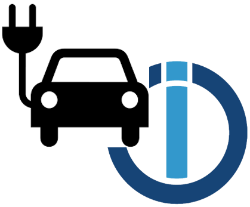

# ioBroker.evsewifi

## evSewifi adapter for ioBroker

Transmitting data from an to the ESVE Wallbox.
SimpleEVSE-WiFi: https://github.com/CurtRod/SimpleEVSE-WiFi

## Important Information:
Currently ther is a Bug in the SimpleESVE-Wifi. When using the API to get the Log when the Log is empty it can cause a crash on the wallbox which needs to be rebooted to fix. 
Issue: https://github.com/CurtRod/SimpleEVSE-WiFi/issues/62

Solution: When perceive problems change the configuration on the Adapter: 
 > "Number of Logs to Show" set to 0. 
Then no Logs will be requested.

## Paramter Description
Parameter | Description
--------- | -----------
vehicleState | Vehicle state (ready / detected / charging)
evseState | EVSE State (active/not active)
maxCurrent | Maximum Current depending on PP-limit and 
actualCurrent | Actual configured current in A (e.g. 20A)
actualPower | actual power consumption (when S0 meter is used)
duration | charging duration in milliseconds
alwaysActive | Always Active Mode enabled (true/false)
lastActionUser | The user name of the user who performed the last action (activate/deactivate)
lastActionUID | The UID of the user who performed the last action (activate/deactivate)
energy | charged energy of the current charging process in kWh
mileage | charged energy in km
meterReading | actual meter reading in kWh
currentP1 | actual current in A (phase 1)
currentP2 | actual current in A (phase 2)
currentP3 | actual current in A (phase 3)
useMeter | energy meter is configured in EVSE-WiFi (true/false)

## Changelog
### 1.0.0
* (JFK344) First release

### 0.0.1
* (JFK344) initial release

## License
Copyright (c) 2021 JFK344 <info@jfk.rocks>

MIT License

Permission is hereby granted, free of charge, to any person obtaining a copy
of this software and associated documentation files (the "Software"), to deal
in the Software without restriction, including without limitation the rights
to use, copy, modify, merge, publish, distribute, sublicense, and/or sell
copies of the Software, and to permit persons to whom the Software is
furnished to do so, subject to the following conditions:

The above copyright notice and this permission notice shall be included in all
copies or substantial portions of the Software.

THE SOFTWARE IS PROVIDED "AS IS", WITHOUT WARRANTY OF ANY KIND, EXPRESS OR
IMPLIED, INCLUDING BUT NOT LIMITED TO THE WARRANTIES OF MERCHANTABILITY,
FITNESS FOR A PARTICULAR PURPOSE AND NONINFRINGEMENT. IN NO EVENT SHALL THE
AUTHORS OR COPYRIGHT HOLDERS BE LIABLE FOR ANY CLAIM, DAMAGES OR OTHER
LIABILITY, WHETHER IN AN ACTION OF CONTRACT, TORT OR OTHERWISE, ARISING FROM,
OUT OF OR IN CONNECTION WITH THE SOFTWARE OR THE USE OR OTHER DEALINGS IN THE
SOFTWARE.

Copyright (c) 2021 JFK344 <info@jfk.rocks>
